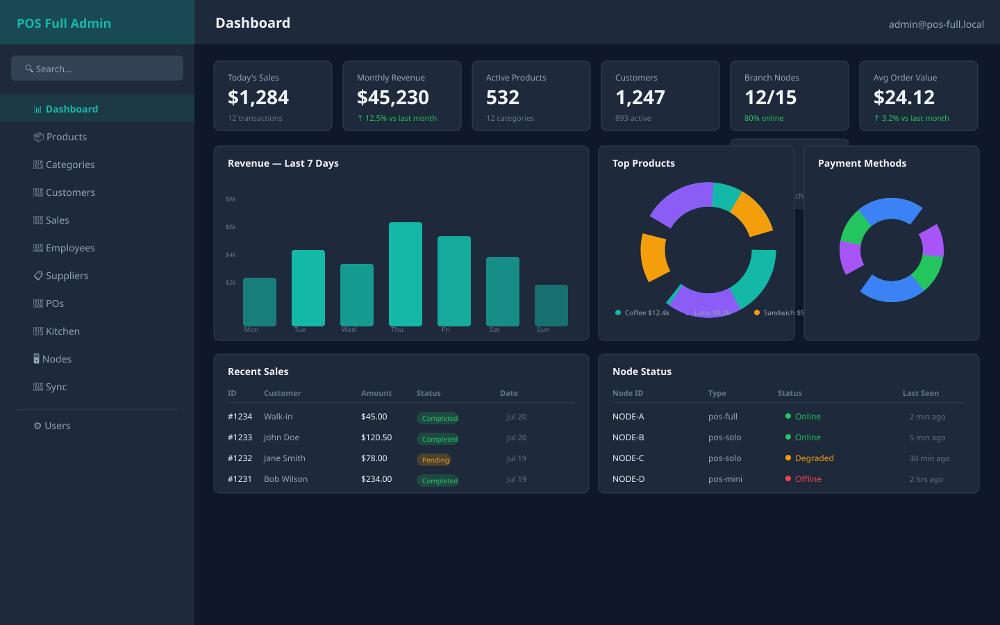
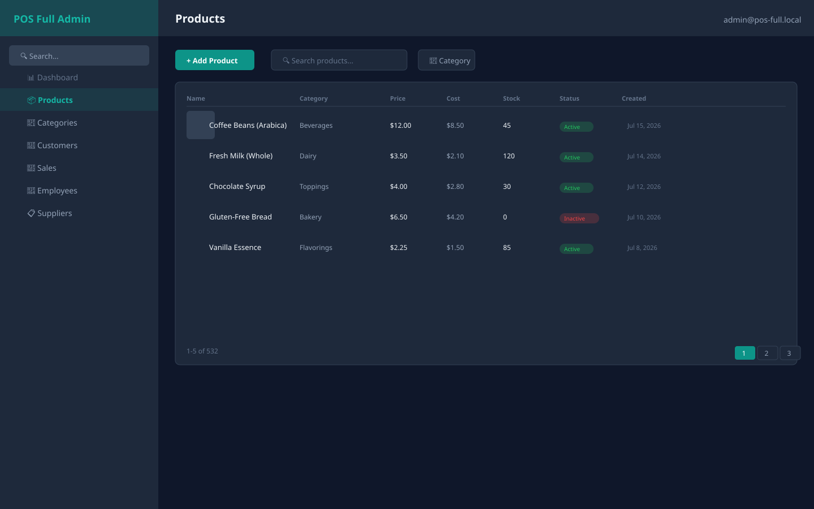
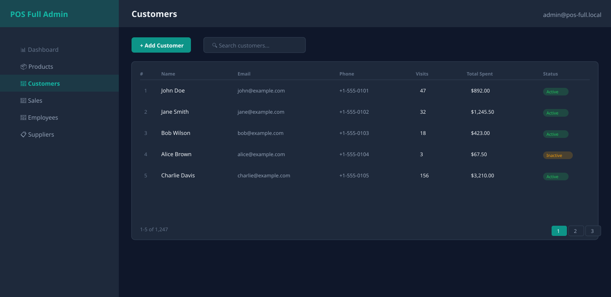
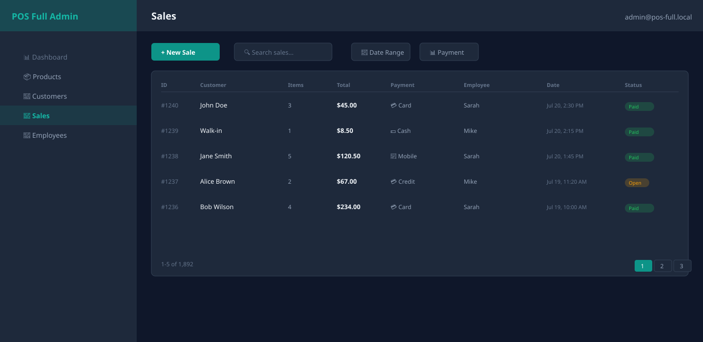

# POS Full — Master Manager

> Central management server with Unfold admin dashboard, REST API, real-time WebSocket entity events, and Django ORM.

**pos-full** is the **master manager** edition of POS. It provides:
- 🎛️ **Unfold Admin Dashboard** — dark-themed admin panel with KPI cards and charts
- 🌐 **REST API** — Robyn sidecar on port `8766` with paginated CRUD endpoints
- 🔌 **WebSocket entity events** — real-time CRUD notifications for Redux cache invalidation
- 📊 **Node registry** — track all branch device status, heartbeats, and sync logs
- ☁️ **Cloud CRM sync** — push/pull data with upstream CRM
- 🏗️ **Django ORM** — 17+ managed models with automatic migrations

---

## 📸 Dashboard Preview

| Dashboard | Products |
|:---:|:---:|
|  |  |
| *6 KPI cards, 5 charts, 2 data tables* | *Paginated table with status badges* |

| Customers | Sales |
|:---:|:---:|
|  |  |
| *Filterable customer registry* | *Payment method breakdown* |

> **Tip:** Run `make admin-screenshots` after starting the server to capture live JPG screenshots from your running instance.

---

## 🚀 Quick Start

```bash
# 1. Install dependencies
cd sidecar && pip install -r requirements.txt && cd ..

# 2. Start the REST API server (Robyn sidecar)
python3 sidecar/server.py --port 8766

# 3. (Optional) Start Django admin panel
# In a separate terminal:
python3 sidecar/manage.py migrate
python3 sidecar/manage.py createsuperuser
python3 sidecar/manage.py runserver 0.0.0.0:8000

# 4. Start React frontend (in another terminal)
pnpm install && pnpm dev
```

| Service | URL | Purpose |
|---------|-----|---------|
| **REST API** | `http://localhost:8766` | CRUD endpoints for all entities |
| **Admin Panel** | `http://localhost:8000/admin/` | Unfold dark-themed dashboard |
| **WebSocket** | `ws://localhost:8766/ws/entities` | Real-time entity events |
| **WebSocket** | `ws://localhost:8766/ws/nodes` | Node status events |
| **WebSocket** | `ws://localhost:8766/ws/config` | Config change events |

---

## 🎛️ Admin Dashboard

The admin panel uses **[Django Unfold](https://unfoldadmin.com/)** — a modern, dark-themed admin interface.

### Access

#### Quick bootstrap (auto-migrate + superuser + runserver)

```bash
cd pos-full
make admin-bootstrap
# → Runs: migrate → auto-create superuser → start :8000
# → Open http://localhost:8000/admin/
```

#### Manual setup

```bash
# 1. Create admin superuser (interactive)
cd sidecar
python3 manage.py createsuperuser
# → Enter email, username, password

# Or auto-create from environment variables (idempotent):
python3 manage.py --ensure-superuser
# → Reads: POS_FULL_ADMIN_EMAIL, POS_FULL_ADMIN_PASSWORD, POS_FULL_ADMIN_NAME
# → Defaults: admin@pos-full.local / admin123 / "POS Full Admin"

# 2. Start admin panel
python3 manage.py runserver 0.0.0.0:8000
# → Open http://localhost:8000/admin/
```

| Env Var | Default | Purpose |
|---------|---------|---------|
| `POS_FULL_ADMIN_EMAIL` | `admin@pos-full.local` | Superuser email / login |
| `POS_FULL_ADMIN_PASSWORD` | `admin123` | Superuser password |
| `POS_FULL_ADMIN_NAME` | `POS Full Admin` | Display name (split into first/last) |

#### Makefile targets

| Target | Description |
|--------|-------------|
| `make admin-bootstrap` | Full pipeline: migrate → ensure-superuser → runserver :8000 |
| `make admin-ensure-superuser` | Idempotent superuser creation from env vars |

### KPI Cards (7)

| Card | Description | Data Source |
|------|-------------|-------------|
| 📈 Today's Sales | Current day revenue + transaction count | `Sale.sale_date` today filter |
| 💰 Monthly Revenue | This month total with % vs last month trend | `Sale.sale_date` month aggregation |
| 🧾 **Avg Order Value** | Revenue per order with % vs last month trend | `Sum(total) / Count(id)` this month |
| 📦 Active Products | Total active products + category count | `Product.is_active` count |
| 👥 Customers | Active + total registered customers | `Customer` model counts |
| 🖥️ Branch Nodes | Online/total nodes ratio | `Node.status` filter |
| ⚠️ Open Alerts | Support tickets + pending kitchen + draft POs | Aggregation across 3 models |

### Charts (5)

| Chart | Type | Description |
|-------|------|-------------|
| Revenue — Last 7 Days | `bar` | Daily revenue totals |
| Top Products by Revenue | `pie` | Top 10 products by `SaleItem.line_total` |
| Sales by Payment Method | `doughnut` | Cash / Card / Mobile / Mixed / Credit |
| Hourly Revenue | `bar` | Revenue by hour of day (24 bins) |
| Hourly Transactions | `bar` | Transaction count by hour of day |

All charts filter to the **last 7 days** for real-time relevance.

### Tables (2)

| Table | Rows | Columns |
|-------|------|---------|
| Recent Sales | 5 | ID, Customer, Amount, Status, Date |
| Node Status | 5 | Node ID, Type, Status, Last Seen |

### Registered Models (17+)

All managed models are registered in the admin with Unfold-themed UI:

| Category | Models |
|----------|--------|
| **POS Core** | Product, Category, Customer, Sale, SaleItem, Employee, InventoryTransaction |
| **Menu** | MenuItem, Menu, MenuItemAssignment |
| **Operations** | Supplier, PurchaseOrder, PurchaseOrderItem, KitchenTicket, SupportTicket |
| **Nodes & Sync** | Node, Heartbeat, NodeEvent, SyncLog, DeviceConfig, MasterDevice, CloudLink |
| **System** | User, Group (Django auth) |

Each model admin includes:
- `list_filter_submit` — filter sidebar with Apply button
- `list_fullwidth` — full-width table layout
- `compressed_fields` — compact form fields
- Material design icons in sidebar navigation

---

## 🌐 REST API

The Robyn sidecar serves all CRUD endpoints with **pagination** support.

### Pagination

Every list endpoint supports `?page=` and `?per_page=` query params:

```bash
curl "http://localhost:8766/products?page=1&per_page=20"
```

Response format:
```json
{
  "data": [
    { "id": 1, "name": "Coffee", "price": 4.50, ... }
  ],
  "pagination": {
    "page": 1,
    "per_page": 20,
    "total": 532,
    "total_pages": 27
  }
}
```

### Key Endpoints

| Method | Endpoint | Description |
|--------|----------|-------------|
| `GET/POST` | `/products` | List (paginated) / Create product |
| `PATCH/DELETE` | `/products/:id` | Update / Delete product |
| `GET/POST` | `/customers` | List / Create customer |
| `GET/POST` | `/sales` | List / Create sale |
| `GET/POST` | `/employees` | List / Create employee |
| `GET/POST` | `/inventory` | List / Create inventory transaction |
| `GET/POST` | `/suppliers` | List / Create supplier |
| `GET/POST` | `/purchase-orders` | List / Create purchase order |
| `GET/POST` | `/kitchen-tickets` | List / Create kitchen ticket |
| `GET/POST` | `/support-tickets` | List / Create support ticket |
| `GET/POST` | `/nodes/register` | Register a branch device node |
| `POST` | `/nodes/heartbeat` | Branch device heartbeat |

> Full endpoint list: ~30+ CRUD routes + 10+ custom routes

---

## 🔌 WebSocket Streams

The sidecar provides three WebSocket endpoints for real-time features:

### `/ws/entities` — Entity CRUD Events

Broadcasts whenever any entity is created, updated, or deleted:

```json
{
  "type": "entity_event",
  "entity": "Product",
  "action": "create",
  "data": { "id": 42, "name": "Latte", "price": 5.50 },
  "timestamp": "2026-07-20T12:00:00+00:00"
}
```

**Used by**: Redux RTK Query middleware to auto-invalidate caches.

### `/ws/nodes` — Node Status Events

Tracks branch device registration, heartbeat, and status changes.

### `/ws/config` — Configuration Events

Configuration changes pushed to/from branch devices.

---

## 🏗️ Architecture

```
┌──────────────────────────────────────────────────────────────┐
│  pos-full (Master Manager) — port 8766                       │
│                                                              │
│  ┌──────────────────────────────────┐                        │
│  │  React Frontend                  │                        │
│  │  ┌────────────────────────────┐  │                        │
│  │  │ Redux Toolkit (RTK Query)  │──│──→ fetch(:8766)        │
│  │  │   ├─ Cache invalidation    │  │                        │
│  │  │   ├─ Pagination            │  │                        │
│  │  │   └─ WS middleware         │←─│─── WS(:8766)           │
│  │  └────────────────────────────┘  │                        │
│  └──────────────────────────────────┘                        │
│                                                              │
│  ┌──────────────────────────────────┐                        │
│  │  Django Admin (Unfold) :8000     │                        │
│  │  ├─ Dashboard (KPIs+Charts)     │                        │
│  │  └─ Model CRUD (17+ models)     │                        │
│  └──────────────────────────────────┘                        │
│                                                              │
│  ┌──────────────────────────────────┐                        │
│  │  Robyn Sidecar :8766             │                        │
│  │  ├─ CRUD endpoints (30+)        │                        │
│  │  ├─ Paginated queries           │                        │
│  │  ├─ WebSocket /ws/entities      │                        │
│  │  ├─ WebSocket /ws/nodes, /ws/config                       │
│  │  └─ Entity event broadcasting   │                        │
│  └──────────────────────────────────┘                        │
│                                                              │
│  ┌──────────────────────────────────┐                        │
│  │  Django ORM (SQLite)             │                        │
│  │  ├─ models/pos.py — POS core    │                        │
│  │  ├─ models/node.py — Registry   │                        │
│  │  ├─ models/config.py — Config   │                        │
│  │  ├─ models/inventory.py — Ops   │                        │
│  │  ├─ models/ops.py — Support     │                        │
│  │  └─ models/menu.py — Menu       │                        │
│  └──────────────────────────────────┘                        │
│                                                              │
│  ┌────────────┐   ┌────────────┐  ┌────────────┐            │
│  │ pos-solo   │   │ pos-solo   │  │ pos-mini   │            │
│  │ Branch #1  │   │ Branch #2  │  │ (Rust/Diesel)           │
│  └────────────┘   └────────────┘  └────────────┘            │
│       └──────────────┬──────────────────────┘               │
│                      │ HTTP / WS                              │
│                      ▼                                       │
│              pos-full Master :8766                            │
└──────────────────────────────────────────────────────────────┘
```

---

## 📁 Directory Structure

```
pos-full/
├── src/                          # React + TypeScript + Tailwind
│   ├── store/                    # Redux Toolkit (RTK Query)
│   │   ├── api/
│   │   │   ├── baseApi.ts        # createApi with 28 tagTypes
│   │   │   └── endpoints/        # Entity endpoint slices
│   │   └── middleware/
│   │       └── websocket.ts      # WS entity cache invalidation
│   ├── pages/                    # 22 page components
│   └── components/               # Shared UI components
├── sidecar/
│   ├── configs/                  # Centralized settings
│   │   ├── __init__.py           # Django + Unfold settings
│   │   ├── admin.py              # Model admin registrations (17+)
│   │   ├── dashboard.py          # Custom dashboard (6 KPI + 5 charts + 2 tables)
│   │   └── urls.py               # Django URL configuration
│   ├── server.py                 # Robyn async server entry point
│   ├── handlers.py               # CRUD factory with WS broadcast
│   ├── streams.py                # WebSocket broadcast functions
│   ├── models/                   # Django ORM models
│   │   ├── pos.py                # Category, Product, Customer, Sale, ...
│   │   ├── node.py               # Node, Heartbeat, NodeEvent
│   │   ├── config.py             # DeviceConfig, MasterDevice, CloudLink
│   │   ├── inventory.py          # Supplier, PurchaseOrder
│   │   ├── ops.py                # KitchenTicket, SupportTicket
│   │   └── menu.py               # MenuItem, Menu
│   └── routes/                   # Custom Robyn route handlers
│       ├── nodes.py              # Node registration/heartbeat/WS
│       ├── config.py             # Device config/WS
│       ├── sync.py               # Sync status/trigger
│       └── approvals.py          # Sync approval workflow
├── src-tauri/                    # Tauri/Rust shell
└── scripts/                      # Dev/build utilities
```

---

## 🧪 Testing

```bash
cd sidecar
DJANGO_SETTINGS_MODULE='' python3 -m pytest tests/test_server.py -v --tb=short
# → 53 tests pass (node registry, heartbeats, sync, events, broadcast)
```

---

## 🛠️ Configuration

### Environment Variables

| Variable | Default | Description |
|----------|---------|-------------|
| `POS_FULL_HOST` | `0.0.0.0` | Sidecar bind address |
| `POS_FULL_PORT` | `8766` | Sidecar port |
| `POS_FULL_API_KEY` | `None` | API authentication key |
| `DJANGO_SECRET_KEY` | `pos-full-master-...` | Django secret key |
| `CLOUD_CRM_URL` | `""` | Upstream CRM API URL |
| `CLOUD_API_KEY` | `None` | CRM API key |

### Sidecar Arguments

```bash
python3 server.py --host 0.0.0.0 --port 8766 --verbose
python3 server.py --migrate          # Use Django migrations (vs schema_editor)
python3 server.py --version          # Show version
```

---

## 📚 Edition Comparison

| Feature | pos-mini | pos-solo | pos-full |
|---------|----------|----------|----------|
| Backend | Rust/Diesel | Robyn + Django | Robyn + Django |
| Admin panel | ❌ | ❌ | ✅ Unfold dashboard |
| Data ops | `invoke()` | Redux RTK Query | Redux RTK Query |
| Paginated API | ❌ | ✅ | ✅ |
| Entity WS events | ❌ | ✅ | ✅ |
| Node registry | ❌ | ✅ | ✅ |
| Cloud sync | ❌ | ✅ | ✅ |
| WebSocket chat | ❌ | ❌ | ✅ |

---

## 🔗 Related

- **pos-solo**: Branch device — [../pos-solo/](../pos-solo/)
- **pos-mini**: Minimal Rust/Diesel edition — [../pos-mini/](../pos-mini/)
- **Architecture docs**: [../../docs/POS_ARCHITECTURE.md](../../docs/POS_ARCHITECTURE.md)
