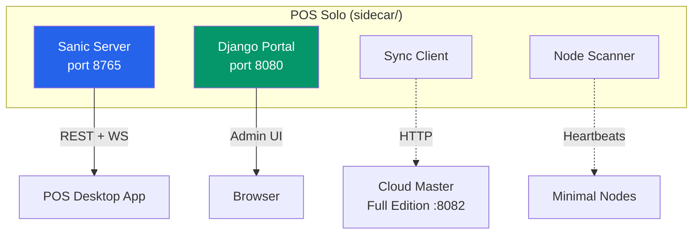

# POS Solo — Sidecar Architecture

```
sidecar/
├── server.py           # 🔵 Sanic REST API (chat, support, invoices, data)
├── sync_client.py      # 🟢 Cloud CRM sync client
├── sync_routes.py      # 🟢 Sync API Blueprint (status, config, trigger)
├── node_scanner.py     # 🟢 Node discovery & heartbeat receiver
├── webhook_sender.py   # 🟢 Webhook forwarder to Cloud Master
├── posapp/models.py    # 🔵 Django ORM models (legacy posapp mirror)
├── build.py            # 🔧 PyInstaller build script
├── requirements.txt    # 📦 Dependencies (sanic + httpx + django)
├──
├── settings.py         # 🔵 Django settings (portal + node API)
├── manage.py           # 🔵 Django management entry point
├── urls.py             # 🔵 Django URL configuration
├── asgi.py / server.py # 🔵 Django ASGI/WSGI entry
├── shared/             # 🟢 Django app: models (MenuItem, Category), admin, viewsets
├── portal/             # 🟢 Django app: portal views (django-fusion)
├── node/               # 🟢 Django app: node API (heartbeat, register, transactions)
└── docs/               # 📚 Documentation (future)
```

## Server Components

| Layer | Component | Role |
|-------|-----------|------|
| 🟢 API | `server.py` (Sanic) | REST API for Tauri frontend (chat, tickets, customers, invoices, data) |
| 🟢 Sync | `sync_routes.py` + `sync_client.py` | Push POS data to Cloud Master (Full edition) |
| 🟢 Scanner | `node_scanner.py` | Receive heartbeats from Minimal nodes |
| 🟢 Webhook | `webhook_sender.py` | Forward aggregated data to Cloud Master |
| 🔵 Portal | Django (`settings.py` + `shared/` + `portal/`) | Admin UI, menu dashboard, django-fusion viewsets |
| 🔵 Node API | Django (`node/`) | Node registration, heartbeat, transaction endpoints |

## Architecture



## Usage

```bash
# Start Sanic sidecar (API for Tauri frontend)
python server.py --db ../restaurant.db --port 8765

# Start Django portal (admin + node API)
python manage.py migrate
python manage.py runserver 0.0.0.0:8080

# Start node agent
python manage.py run_node --master http://localhost:8080 --interval 60
```

## Customization Points

| Component | File | Tag |
|-----------|------|-----|
| Sanic routes | `server.py` | 🟢 customizable |
| Django viewsets | `shared/portal_viewsets.py` | 🟢 customizable |
| Node API | `node/views.py` | 🟢 customizable |
| Portal templates | `shared/templates/` | 🔵 template |
| Django models | `shared/models.py` | 🟢 customizable |
| Sync client | `sync_client.py` / `sync_views.py` | 🟢 customizable |
| Build pipeline | `build.py` / `build.sh` | 🔴 not-customizable |
| Sanic WebSocket | `server.py` ws handlers | 🔴 not-customizable |

<!-- @tested pos/solo - Sidecar architecture documented -->
