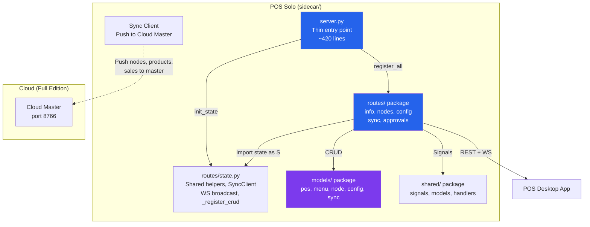

# POS Solo — Sidecar Architecture

## Package Structure

```
sidecar/
├── server.py                 # 🟢 Thin entry point: bootstrap + middleware + CRUD (~420 lines)
├── routes/                   # 🟢 Route handler modules
│   ├── __init__.py           #   register_all(app)
│   ├── state.py              #   Shared helpers, SyncClient, WS broadcast, _register_crud
│   ├── info.py               #   /, /health, /stats (~45 lines)
│   ├── nodes.py              #   Node CRUD, register, heartbeat, WS /ws/config (~180 lines)
│   ├── config.py             #   Device/Master/Cloud config (~95 lines)
│   ├── sync.py               #   Sync status, trigger, push (~140 lines)
│   └── approvals.py          #   Approve, reject, pending (~40 lines)
├── models/                   # 🔵 Django ORM models (all managed=True)
│   ├── __init__.py
│   ├── pos.py                # Category, Product, Customer, Sale, SaleItem, Inventory, Employee
│   ├── menu.py               # MenuItem, Menu, MenuItemAssignment
│   ├── node.py               # Node, Heartbeat, NodeEvent
│   ├── config.py              # DeviceConfig, MasterDevice, CloudLink
│   └── sync.py                # SyncLog
├── tests/
│   ├── test_unified_api.py   # 155 tests (decoupled from server.py)
│   └── django_setup.py       # Standalone Django bootstrap helper
├── Makefile                  # Sidecar commands
└── requirements.txt          # Dependencies
```

## Server Components

| Layer | Component | Role |
|-------|-----------|------|
| 🟢 Server | `server.py` | Thin entry point: Django bootstrap, middleware, CRUD registration, `init_state()`, `register_all()` |
| 🟢 Routes | `routes/info.py` | `GET /`, `/health`, `/stats` |
| 🟢 Routes | `routes/nodes.py` | Node CRUD, register, heartbeat, WS `/ws/config` |
| 🟢 Routes | `routes/config.py` | Device/Master/Cloud config, WS `/ws/config` |
| 🟢 Routes | `routes/sync.py` | Sync status, trigger, push, cloud push |
| 🟢 Routes | `routes/approvals.py` | Approve, reject, pending, receive endpoints |
| 🟢 State | `routes/state.py` | Shared helpers (`_ser`, `_list`, `_register_crud`), `SyncClient`, WS broadcast |
| 🔵 Models | `models/` package | All 17 unified models (managed=True): pos, menu, node, config, sync |
| 🔵 Shared | `shared/` package | DeviceToken, SyncApproval, SignalEvent, signals, handlers, ProductSyncEngine |
| 🔵 Tests | `tests/django_setup.py` | Standalone Django bootstrap (decoupled from server.py) |

## Shared Module Map

```
projects/pos/shared/
├── signals/__init__.py       # Signal definitions + fire_* helpers
├── models/
│   ├── audit.py              # SignalEvent
│   ├── approval.py           # SyncApproval
│   └── token.py              # DeviceToken
├── handlers/
│   └── signal.py             # @receiver handlers (log, webhook, audit)
├── services/
│   └── sync.py               # ProductSyncEngine
├── middleware/
│   └── auth.py               # create_auth_middleware, register_auth_routes
└── api/
    └── crud.py               # _ser, _paginate, _register_crud helpers
```

## Architecture



## Usage

```bash
# Start Robyn server (main API — no Django portal required)
python3 server.py --port 8765

# Run tests (uses standalone django_setup.py helper)
DJANGO_SETTINGS_MODULE='' python3 -m pytest tests/ -v --import-mode=importlib
```

## Test Results (Session: 2026-07-20)

**Run command:**
```bash
DJANGO_SETTINGS_MODULE='' python3 -m pytest tests/test_unified_api.py -v --import-mode=importlib
```

| Suite | Tests | Passed | Failed | Skipped |
|-------|------:|------:|------:|------:|
| `test_unified_api.py` | 155 | 155 | 0 | 0 |
| **TOTAL** | **155** | **155** | **0** | **0** |

### Analysis

- **155/155 passed (100%)** ✅ — all unified model CRUD, filtering, pagination, and validation tests pass.
- Solo edition uses managed=True models (no Rust DB dependency), making tests fully self-contained.
- Test DB is created in-memory or as `unified.db` in the sidecar directory.

## Streams (WebSocket)

Single WebSocket channel provided by `streams.py`:

| Endpoint | Event Types | Broadcast Function |
|----------|------------|-------------------|
| `/ws/config` | `config_changed`, `config_synced`, `configs_pushed`, `catalog_pushed`, `products_pushed` | `_broadcast_config_event()` |

Filtering: Clients can subscribe to specific `node_id` or `event_type` via WebSocket filters.

## HTML Serving Capability

Same as pos-full: REST JSON + WebSocket only. See `projects/pos/pos-full/sidecar/ARCHITECTURE.md#html-serving-capability` for potential additions.

## Sync

| Feature | Pos-Solo | Pos-Full |
|---------|:---:|:---:|
| Sync endpoints | 11 | 13 |
| Sync direction | Child → Master | Master ↔ Children |
| Approval workflow | ✅ | ✅ |
| Cloud push | ✅ (configured via `CLOUD_CRM_URL`) | ✅ |
| Rust DB mirror | ❌ | ✅ (posapp/) |

## Models

All models share `app_label=pos_unified` and `db_table` prefix `unified_`:

| Model | Module | Table | Purpose |
|-------|--------|-------|---------|
| `Category` | `models/pos.py` | `unified_categories` | Product/menu categories |
| `Product` | `models/pos.py` | `unified_products` | POS products |
| `Customer` | `models/pos.py` | `unified_customers` | Customer records |
| `Sale` | `models/pos.py` | `unified_sales` | POS transactions |
| `SaleItem` | `models/pos.py` | `unified_sale_items` | Line items |
| `InventoryTransaction` | `models/pos.py` | `unified_inventory` | Stock movements |
| `Employee` | `models/pos.py` | `unified_employees` | Staff records |
| `MenuItem` | `models/menu.py` | `unified_menu_items` | Menu items |
| `Menu` | `models/menu.py` | `unified_menus` | Named menus |
| `MenuItemAssignment` | `models/menu.py` | `unified_menu_assignments` | Through table |
| `Node` | `models/node.py` | `unified_nodes` | Registered nodes |
| `Heartbeat` | `models/node.py` | `unified_heartbeats` | Heartbeat audit |
| `NodeEvent` | `models/node.py` | `unified_node_events` | Lifecycle events |
| `SyncLog` | `models/sync.py` | `unified_sync_logs` | Sync audit |
| `DeviceConfig` | `models/config.py` | `unified_device_configs` | Per-node config |
| `MasterDevice` | `models/config.py` | `unified_master_devices` | Master devices |
| `CloudLink` | `models/config.py` | `unified_cloud_links` | Cloud connections |
