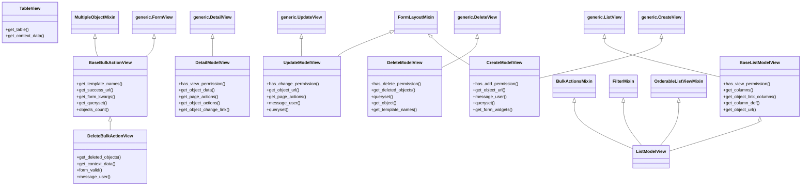

# Design: Components Generic

## Overview

This package (`components.generic`) is part of `django-fusion` and provides reusable components, utilities, or routing helpers.

## Directory

Path: `django_fusion/components/generic`


### Modules
- `actions.py`
- `base.py`
- `create.py`
- `delete.py`
- `detail.py`
- `list.py`
- `search.py`
- `table.py`
- `update.py`

## Architecture / Class Diagram


## Request Flow

1. A request enters the Django view/handler defined in this package.
2. The handler validates input, resolves any related models/components, and builds context.
3. The result is rendered (template/JSON/fragment) and returned to the client.

## Usage Example

```python
from django_fusion.components.generic import TableView

# Wire into urls.py
from django.urls import path
urlpatterns = [
    path('tableview/', TableView.as_view()),
]
```
## Commands / Entry Points

*No management commands are defined here by default.*

If this package exposes management commands, list them below:

```bash
python manage.py <command_name>
```

## Related Documentation

- [Django docs](https://docs.djangoproject.com/)
- [Wagtail docs](https://docs.wagtail.io/)
- Other `django_fusion` packages: see the root `design.md`.
