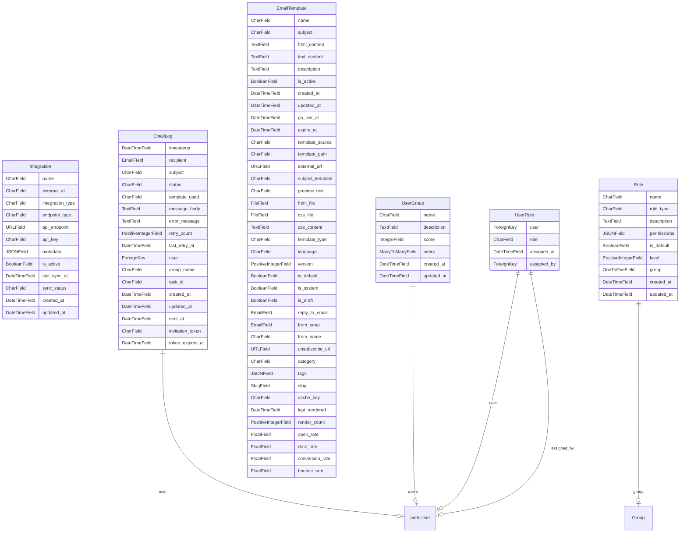

# Design: django-fusion

## Overview

django-fusion — reusable Django and Wagtail helpers for Structa Cloud sites.

## Directory

Path: `django_fusion`


### Modules
- `enums.py`
- `exceptions.py`

## Architecture / ERD


## Request Flow

1. A request enters the Django view/handler defined in this package.
2. The handler validates input, resolves any related models/components, and builds context.
3. The result is rendered (template/JSON/fragment) and returned to the client.

## Usage Example

```python
from django_fusion...models import Integration

# Query and create instances
qs = Integration.objects.all()
obj = Integration.objects.create(name='...', external_id='...', integration_type='...')
```

```python
from django_fusion.. import BaseModelViewset

# Wire into urls.py
from django.urls import path
urlpatterns = [
    path('basemodelviewset/', BaseModelViewset.as_view()),
]
```
## Commands / Entry Points

*No management commands are defined here by default.*

If this package exposes management commands, list them below:

```bash
python manage.py <command_name>
```

## Related Documentation

- [Django docs](https://docs.djangoproject.com/)
- [Wagtail docs](https://docs.wagtail.io/)
- Other `django_fusion` packages: see the root `design.md`.
