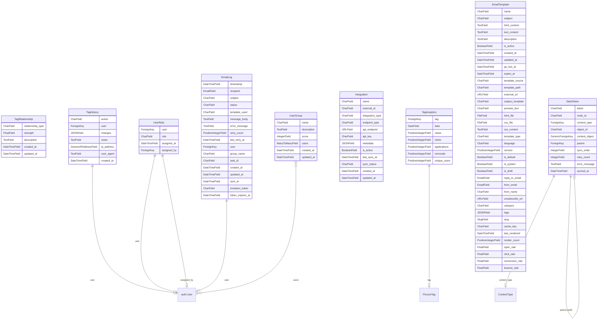

# Design: django-fusion

## Overview

django-fusion — reusable Django and Wagtail helpers for Structa Cloud sites.

## Directory

Path: `django_fusion`


### Modules

- `apps.py`
- `enums.py`
- `exceptions.py`
- `typing.py`
- `builder/`
- `comp/`
- `config/`
- `contrib/`
- `core/`
- `designer/`
- `fragments/`
- `management/`
- `mcp/`
- `models/`
- `plugins/`
- `routes/`
- `services/`
- `tasks/`
- `template_fields/`

## Architecture / ERD


```mermaid
erDiagram
    TagRelationship {
        CharField relationship_type
        FloatField strength
        TextField description
        DateTimeField created_at
        DateTimeField updated_at
    }
    TagHistory {
        CharField action
        ForeignKey user
        JSONField changes
        TextField notes
        GenericIPAddressField ip_address
        TextField user_agent
        DateTimeField created_at
    }
    TagAnalytics {
        ForeignKey tag
        DateField date
        PositiveIntegerField views
        PositiveIntegerField clicks
        PositiveIntegerField applications
        PositiveIntegerField removals
        PositiveIntegerField unique_users
    }
    DataToken {
        CharField token
        CharField node_id
        ForeignKey content_type
        CharField object_id
        GenericForeignKey content_object
        ForeignKey parent
        IntegerField sync_order
        IntegerField retry_count
        TextField error_message
        DateTimeField synced_at
    }
    UserRole {
        ForeignKey user
        CharField role
        DateTimeField assigned_at
        ForeignKey assigned_by
    }
    Integration {
        CharField name
        CharField external_id
        CharField integration_type
        CharField endpoint_type
        URLField api_endpoint
        CharField api_key
        JSONField metadata
        BooleanField is_active
        DateTimeField last_sync_at
        CharField sync_status
        DateTimeField created_at
        DateTimeField updated_at
    }
    EmailLog {
        DateTimeField timestamp
        EmailField recipient
        CharField subject
        CharField status
        CharField template_used
        TextField message_body
        TextField error_message
        PositiveIntegerField retry_count
        DateTimeField last_retry_at
        ForeignKey user
        CharField group_name
        CharField task_id
        DateTimeField created_at
        DateTimeField updated_at
        DateTimeField sent_at
        CharField invitation_token
        DateTimeField token_expires_at
    }
    EmailTemplate {
        CharField name
        CharField subject
        TextField html_content
        TextField text_content
        TextField description
        BooleanField is_active
        DateTimeField created_at
        DateTimeField updated_at
        DateTimeField go_live_at
        DateTimeField expire_at
        CharField template_source
        CharField template_path
        URLField external_url
        CharField subject_template
        CharField preview_text
        FileField html_file
        FileField css_file
        TextField css_content
        CharField template_type
        CharField language
        PositiveIntegerField version
        BooleanField is_default
        BooleanField is_system
        BooleanField is_draft
        EmailField reply_to_email
        EmailField from_email
        CharField from_name
        URLField unsubscribe_url
        CharField category
        JSONField tags
        SlugField slug
        CharField cache_key
        DateTimeField last_rendered
        PositiveIntegerField render_count
        FloatField open_rate
        FloatField click_rate
        FloatField conversion_rate
        FloatField bounce_rate
    }
    UserGroup {
        CharField name
        TextField description
        IntegerField score
        ManyToManyField users
        DateTimeField created_at
        DateTimeField updated_at
    }

    TagHistory ||--o| "auth.User" : "user"
    TagAnalytics ||--o| PersonTag : "tag"
    DataToken ||--o| ContentType : "content_type"
    DataToken ||--o| DataToken : "parent (self)"
    UserRole ||--o| "auth.User" : "user"
    UserRole ||--o| "auth.User" : "assigned_by"
    EmailLog ||--o| "auth.User" : "user"
    UserGroup }o--o{ "auth.User" : "users"
```
## Request Flow

1. A request enters the Django view/handler defined in this package.
2. The handler validates input, resolves any related models/components, and builds context.
3. The result is rendered (template/JSON/fragment) and returned to the client.

## Usage Example

```python
from django_fusion import Integration

# Query and create instances
qs = Integration.objects.all()
obj = Integration.objects.create(name='...', external_id='...', integration_type='...')
```

```python
from django_fusion.. import BaseModelViewset

# Wire into urls.py
from django.urls import path
urlpatterns = [
    path('basemodelviewset/', BaseModelViewset.as_view()),
]
```
## Commands / Entry Points

```bash
python manage.py plugin  # Inspect, describe and verify django-fusion plugins (list, describe, doctor, check).
python manage.py populate_content  # Populate Wagtail pages with multilingual content from a markdown file
python manage.py verify_content  # Generate a markdown report of all published Wagtail pages
python manage.py generate_skeleton_manifest  # Generate a static skeleton manifest JSON for the Astro build.
python manage.py generate_asset_manifest  # 
python manage.py base  # 
python manage.py send_bulk_emails  # Send bulk emails from CSV file with template support
python manage.py populate_homepage  # Populate the site HomePage with sample demo content
python manage.py populate_courses  # Populate site Courses and Events pages with sample content
python manage.py analyze_components_to_webpack  # 
python manage.py webpack_validate  # Validate the webpack bundles.json for the current site.
python manage.py sync_task_history  # Mirror shared BackgroundTaskLog rows into the product TaskExecution website record.
```
## Related Documentation

- [Django docs](https://docs.djangoproject.com/)
- [Wagtail docs](https://docs.wagtail.io/)
- Other `django_fusion` packages: see the root `design.md`.
