# Design: Fragments

## Overview

django_fusion.fragments

## Directory

Path: `django_fusion/fragments`


### Modules

- `page_context.py`
- `registry.py`
- `renderer.py`
- `urls.py`
- `views.py`
- `viewsets.py`
- `analyzer/`
- `forms/`
- `generic/`
- `skeleton/`
- `tables/`

## Architecture / ERD

```mermaid
erDiagram
    CompUsage {
        Field kwargs
        Field skeleton_config
    }
    SectionMarker {
    }
    ParsedTemplate {
        Field sections
    }
    Prop {
    }
    Slot {
    }
    Component {
        Field props
        Field slots
        Field skeleton
        Field skeleton_config
    }
    Block {
    }
    Section {
    }
    Template {
        Field blocks
        Field sections
    }
    PageComponentUsage {
        Field props
        Field skeleton_order
    }
    Page {
        Field components
        Field dependencies
        Field load_priority
    }
    AnalyzeRequest {
        Field filters
    }
    ScannedFile {
        ConfigDict model_config
    }
```


## Request Flow

1. A request enters the Django view/handler defined in this package.
2. The handler validates input, resolves any related models/components, and builds context.
3. The result is rendered (template/JSON/fragment) and returned to the client.

## Usage Example

```python
from django_fusion.fragments import FragmentRequestView

# Wire into urls.py
from django.urls import path
urlpatterns = [
    path('fragmentrequestview/', FragmentRequestView.as_view()),
]
```
## Commands / Entry Points

*No management commands are defined here by default.*

If this package exposes management commands, list them below:

```bash
python manage.py <command_name>
```

## Related Documentation

- [Django docs](https://docs.djangoproject.com/)
- [Wagtail docs](https://docs.wagtail.io/)
- Other `django_fusion` packages: see the root `design.md`.
