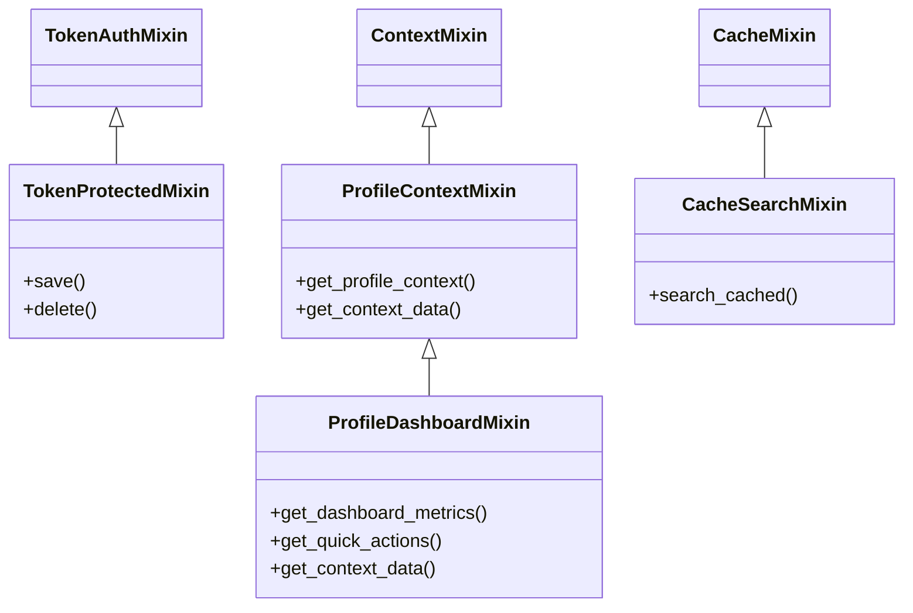

# Design: Site Management Handlers

## Overview

Handler classes and utilities for django_fusion.

## Directory

Path: `django_fusion/site/management/handlers`


### Modules
- `base.py`
- `emails.py`
- `search.py`
- `tagging.py`

## Architecture / Class Diagram


## Request Flow

1. A request enters the Django view/handler defined in this package.
2. The handler validates input, resolves any related models/components, and builds context.
3. The result is rendered (template/JSON/fragment) and returned to the client.

## Usage Example

```python
from django_fusion.management.handlers import TokenProtectedMixin

# Use the mixin in your own view/component class
class MyView(TokenProtectedMixin, TemplateView):
    pass
```
## Commands / Entry Points

*No management commands are defined here by default.*

If this package exposes management commands, list them below:

```bash
python manage.py <command_name>
```

## Related Documentation

- [Django docs](https://docs.djangoproject.com/)
- [Wagtail docs](https://docs.wagtail.io/)
- Other `django_fusion` packages: see the root `design.md`.
