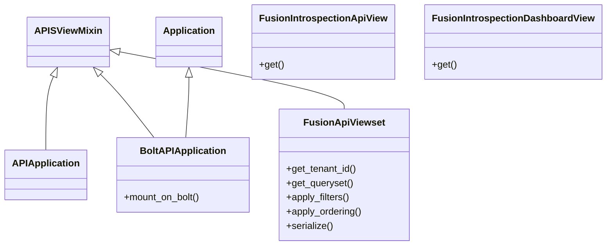

# Design: Comp Plugins

## Overview

This package (`plugins`) is part of `django-fusion` and provides reusable components, utilities, or routing helpers.

## Directory

Path: `django_fusion/plugins`


### Modules

- `attach.py`
- `catalog.py`
- `descriptions.py`
- `hookspecs.py`
- `manager.py`
- `registry.py`
- `tracker.py`
- `apis/`
- `debug_tools/`
- `designer/`
- `htmx/`
- `robyn/`
- `unpoly/`

## Architecture / Class Diagram


## Request Flow

1. A request enters the Django view/handler defined in this package.
2. The handler validates input, resolves any related models/components, and builds context.
3. The result is rendered (template/JSON/fragment) and returned to the client.

## Usage Example

```python
from django_fusion.plugins.manager import pm
from django_fusion.plugins import hookspecs

# Call a hook implemented by registered plugins
results = pm.hook.get_template_directories()

# Register a custom plugin module (replace with your module)
# pm.register(my_plugin_module, "my_project.plugin")
```

## Commands / Entry Points

*No management commands are defined here by default.*

If this package exposes management commands, list them below:

```bash
python manage.py <command_name>
```

## Related Documentation

- [Django docs](https://docs.djangoproject.com/)
- [Wagtail docs](https://docs.wagtail.io/)
- Other `django_fusion` packages: see the root `design.md`.
