# Design: Site Interface Schemas

## Overview

Pydantic response schemas, serializers, and user data schemas.

## Directory

Path: `django_fusion/site/interface/schemas`


### Modules
- `file.py`
- `logging.py`
- `message.py`
- `model_schema.py`
- `notification.py`
- `response.py`
- `serializer.py`

## Architecture / ERD

```mermaid
erDiagram
    APIResponse {
    }
    TokenSchemaBase {
    }
    AccessTokenSchema {
    }
    RefreshTokenSchema {
    }
    SimpleTokenSchema {
    }
    TokenListResponse {
    }
    TokenPairResponse {
    }
    SimpleTokenCreateResponse {
    }
    TokenBase {
        Field preferences
        ConfigDict model_config
    }
    AccessTokenCreate {
        Field user_id
        Field usage
        Field session_token
        Field preferences
        Field expires_in
    }
    RefreshTokenCreate {
        Field user_id
        Field usage
        Field session_token
        Field preferences
        Field expires_in
    }
    TokenPair {
        Field access_token
        Field refresh_token
        Field access_token_expires
        Field refresh_token_expires
        Field token_type
        ConfigDict model_config
    }
    TokenValidationResult {
        Field valid
        Field user_id
        Field token_type
        Field expires_at
        Field error
        Field code
        Field cached
        Field validated_at
        ConfigDict model_config
    }
    ActionTokenCreate {
        Field user_id
        Field action
        Field metadata
        Field expires_in
    }
    ActionTokenResult {
        Field token
        Field token_id
        Field action
        Field expires_at
        Field expires_in
        Field user_id
        ConfigDict model_config
    }
    EmailVerificationToken {
        Field email
        Field user_id
        Field expires_at
        Field token
        Field token_id
        ConfigDict model_config
    }
    TokenResponse {
        Field success
        Field data
        Field error
        Field code
        Field timestamp
        ConfigDict model_config
    }
    UserTokensResponse {
        Field count
        Field tokens
        Field active_count
        Field user_id
    }
    TokenRefreshRequest {
        Field refresh_token
        Field usage
    }
    TokenRevokeRequest {
        Field token
        Field all_tokens
        Field session_token
    }
    PasswordResetRequest {
        Field email
        Field redirect_url
    }
    PasswordResetConfirm {
        Field token
        Field new_password
        Field confirm_password
    }
    EmailVerificationRequest {
        Field email
        Field user_id
    }
    EmailVerificationConfirm {
        Field token
    }
    TokenStatistics {
        Field total
        Field active
        Field expired
        Field revoked
        Field by_type
        Field by_usage
        Field generated_at
        ConfigDict model_config
    }
    AuthenticatedUser {
        Field id
        Field email
        Field name
        Field is_email_verified
        Field is_active
        Field profile_completion
        ConfigDict model_config
    }
    AuthResponse {
        Field user
        Field tokens
        Field requires_verification
        Field message
    }
    JWTClaims {
        Field user_id
        Field token_type
        Field exp
        Field iat
        Field jti
        Field usage
        Field refresh_jti
        Field action
        Field metadata
    }
    TokenCacheData {
        Field token
        Field user_id
        Field valid
        Field validated_at
        Field expires_at
        ConfigDict model_config
    }
    BulkTokenOperation {
        Field user_ids
        Field token_type
        Field before_date
        Field action
    }
    WebhookTokenEvent {
        Field event_type
        Field token_id
        Field user_id
        Field timestamp
        Field data
        ConfigDict model_config
    }
    GroupSchema {
    }
    TokenBaseSchema {
        Field preferences
    }
    UserBaseSchema {
        Field first_name
        Field last_name
    }
    UserCreateSchema {
        Field email
        Field password
        Field confirm_password
        Field name
        Field first_name
        Field last_name
        Field phone_number
        Field language
        Field timezone
        Field send_verification_email
        Field groups
    }
    UserDetailSchema {
        Field is_email_verified
        Field is_phone_verified
        Field profile_completion
        Field language
        Field timezone
        Field is_active
        Field is_staff
        Field is_admin
        Field is_superuser
        Field failed_login_attempts
        Field groups
        Field token_id
    }
    UserUpdateSchema {
        Field name
        Field first_name
        Field last_name
        Field phone_number
        Field language
        Field timezone
        Field is_active
        Field groups
    }
    UserProfileUpdateSchema {
        Field name
        Field first_name
        Field last_name
        Field phone_number
        Field language
        Field timezone
    }
    ChangePasswordSchema {
        Field current_password
        Field new_password
        Field confirm_password
    }
    PasswordResetRequestSchema {
        Field email
    }
    PasswordResetConfirmSchema {
        Field token
        Field new_password
        Field confirm_password
    }
    EmailVerificationRequestSchema {
        Field email
    }
    EmailVerificationConfirmSchema {
        Field token
    }
    UserFilterSchema {
        Field search
        Field email
        Field name
        Field is_active
        Field is_email_verified
        Field is_staff
        Field is_admin
        Field is_superuser
        Field language
        Field group_id
        Field group_name
        Field date_joined_from
        Field date_joined_to
        Field last_login_from
        Field last_login_to
        Field profile_completion_min
        Field profile_completion_max
    }
    UserOrderSchema {
        Field order_by
        Field page
        Field page_size
    }
    LoginSchema {
        Field email
        Field password
        Field device_info
        Field ip_address
        Field user_agent
        Field remember_me
    }
    RegisterSchema {
        Field email
        Field password
        Field confirm_password
        Field name
        Field first_name
        Field last_name
        Field phone_number
        Field language
        Field timezone
        Field device_info
        Field auto_login
        Field send_verification_email
    }
    EnableDisableUserSchema {
        Field user_id
        Field action
    }
    EnableDisableUserResponseSchema {
        Field message
        Field user_id
        Field new_status
        Field timestamp
    }
    LoginResponseSchema {
        Field user
        Field access_token
        Field refresh_token
        Field access_token_expires
        Field refresh_token_expires
        Field token_type
        Field last_login
        Field requires_verification
        Field session_id
    }
    RegisterResponseSchema {
        Field user
        Field tokens
        Field verification_required
        Field verification_sent
        Field message
    }
    PaginatedResponseSchema {
        Field count
        Field next
        Field previous
        Field page
        Field page_size
        Field total_pages
        Field results
    }
    UserListResponseSchema {
        Field results
    }
    TokenResponseSchema {
        Field success
        Field data
        Field error
        Field code
    }
    ProfileCompletionSchema {
        Field total
        Field details
        Field missing_fields
        Field suggestions
    }
    UserStatisticsSchema {
        Field total_users
        Field active_users
        Field verified_users
        Field staff_users
        Field admin_users
        Field superuser_users
        Field verification_rate
        Field avg_profile_completion
        Field registrations_today
        Field active_today
        Field generated_at
    }
    UserExportRequestSchema {
        Field format
        Field include_inactive
        Field fields
        Field filters
    }
    UserBulkOperationSchema {
        Field user_ids
        Field action
    }
    UserBulkOperationResponseSchema {
        Field action
        Field total
        Field successful
        Field failed
        Field errors
        Field timestamp
    }
    TokenSchema {
        Field user
        Field parent_token
        Field children
    }
    TokenRefreshSchema {
        Field refresh_token
        Field usage
    }
    TokenRevokeSchema {
        Field token
        Field all_tokens
        Field session_token
    }
    TokenListResponseSchema {
        Field results
    }
    UserEventSchema {
        Field event_type
        Field user_id
        Field email
        Field timestamp
        Field ip_address
        Field user_agent
        Field metadata
    }
    WebhookUserEventSchema {
        Field event
        Field data
        Field webhook_id
        Field signature
        Field timestamp
    }
    TokenUsageStats {
        Field avg_lifetime
        Field most_common_usage
    }
    UserTokenSummary {
        ConfigDict model_config
    }
    TokenAuditLog {
        ConfigDict model_config
    }
    RateLimitInfo {
        Field limit
        Field remaining
        Field reset_time
        ConfigDict model_config
    }
    TokenSecurityCheck {
        Field security_score
        Field issues
        Field recommendations
        Field last_security_check
        ConfigDict model_config
    }
    MultiFactorAuthRequest {
        Field device_info
        Field ip_address
    }
    MultiFactorAuthResponse {
        Field token
        Field expires_at
        Field delivery_method
        ConfigDict model_config
    }
    SessionInfo {
        Field is_current
        ConfigDict model_config
    }
    TokenHealthCheck {
        Field database
        Field cache
        Field jwt_signing
        Field total_tokens
        Field expired_tokens
        Field avg_response_time
        Field last_cleanup
        ConfigDict model_config
    }
    TokenExportRequest {
        Field user_id
        Field token_type
        Field date_from
        Field date_to
        Field format
        Field include_revoked
        Field include_expired
        ConfigDict model_config
    }
    TokenImportRequest {
        Field tokens
        Field skip_existing
        Field validate_before_import
    }
    BatchTokenOperationResult {
        Field total
        Field successful
        Field failed
        Field errors
        Field duration
    }
```


## Request Flow

1. A request enters the Django view/handler defined in this package.
2. The handler validates input, resolves any related models/components, and builds context.
3. The result is rendered (template/JSON/fragment) and returned to the client.

## Usage Example

```python
from django_fusion.site.interface.schemas.models import APIResponse

# Query and create instances
qs = APIResponse.objects.all()
obj = APIResponse.objects.create(name='...')
```
## Commands / Entry Points

*No management commands are defined here by default.*

If this package exposes management commands, list them below:

```bash
python manage.py <command_name>
```

## Related Documentation

- [Django docs](https://docs.djangoproject.com/)
- [Wagtail docs](https://docs.wagtail.io/)
- Other `django_fusion` packages: see the root `design.md`.
